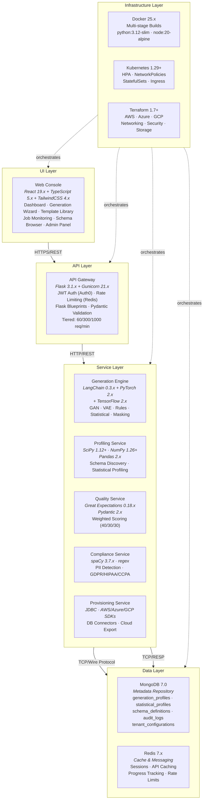
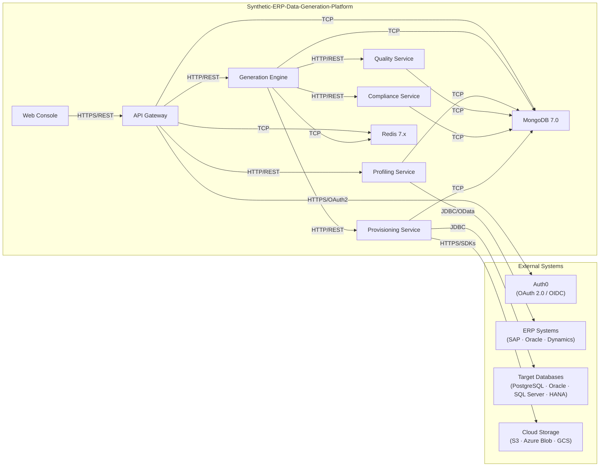
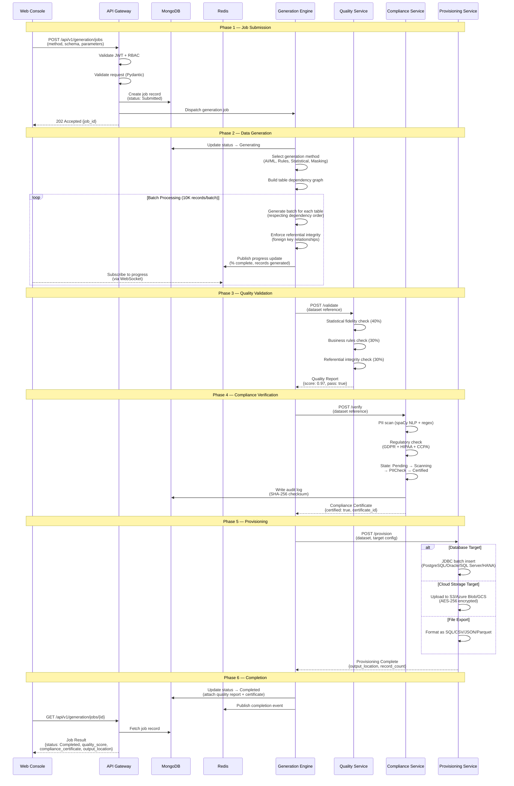
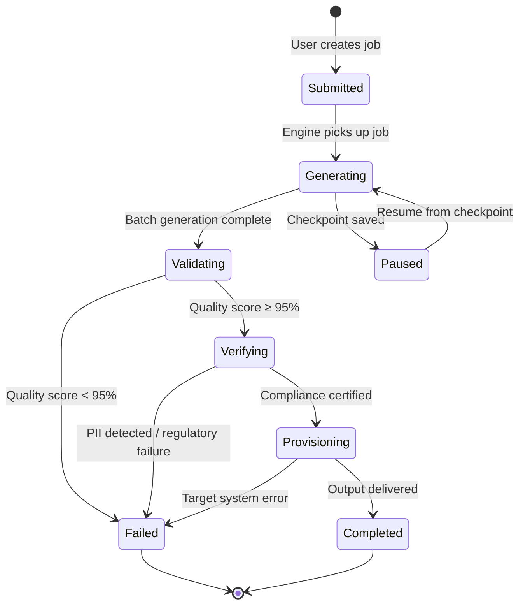
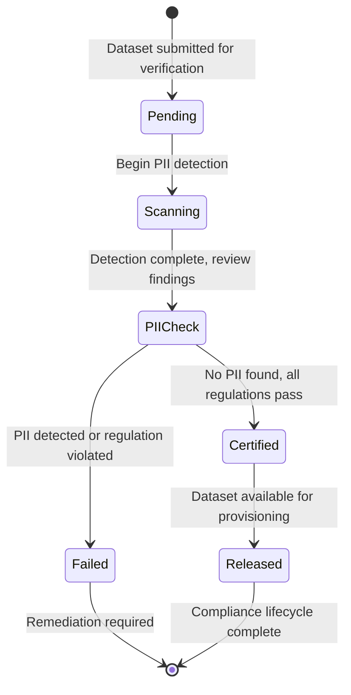
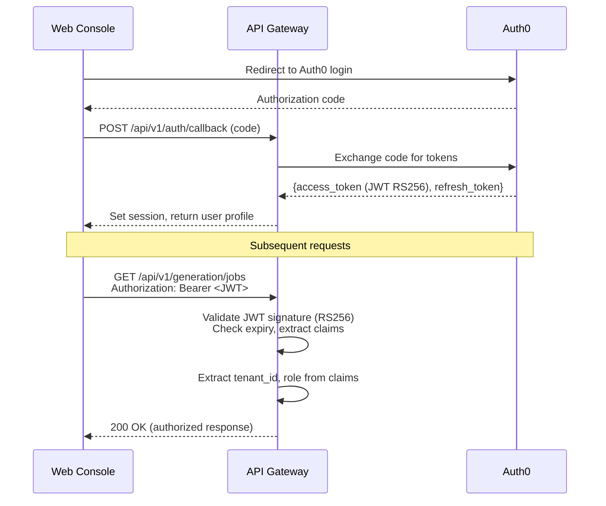
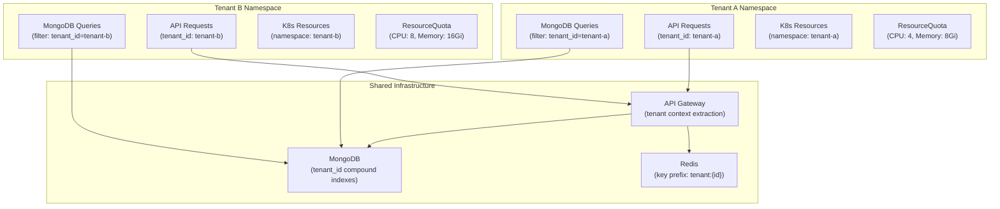
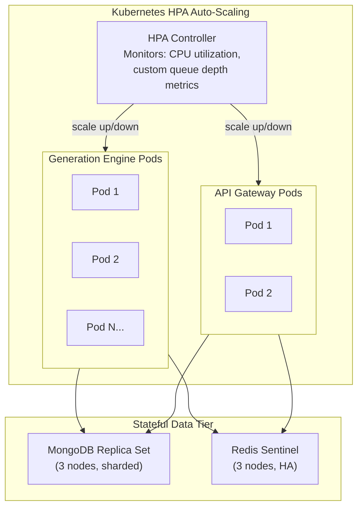

# Synthetic-ERP-Data-Generation-Platform — Architecture Overview

> **Document Status:** Authoritative Architecture Reference  
> **Version:** 1.0.0  
> **Last Updated:** 2025  
> **Audience:** Engineers, Architects, DevOps, Security, QA

---

## Table of Contents

1. [Introduction](#1-introduction)
2. [System Overview](#2-system-overview)
3. [5-Layer Architecture](#3-5-layer-architecture)
4. [Component Architecture Details](#4-component-architecture-details)
5. [Inter-Service Communication Map](#5-inter-service-communication-map)
6. [Data Flow — Generation Pipeline](#6-data-flow--generation-pipeline)
7. [Design Patterns](#7-design-patterns)
8. [Security Architecture](#8-security-architecture)
9. [Multi-Tenant Architecture](#9-multi-tenant-architecture)
10. [Scalability Architecture](#10-scalability-architecture)
11. [Key Algorithms](#11-key-algorithms)
12. [Technology Stack Summary](#12-technology-stack-summary)
13. [Error Handling Strategy](#13-error-handling-strategy)

---

## 1. Introduction

### 1.1 Purpose

This document serves as the **authoritative architecture reference** for the Synthetic-ERP-Data-Generation-Platform, an enterprise-grade solution for generating high-fidelity synthetic data that mirrors the structure, relationships, and statistical properties of production ERP systems. It is the single source of truth for architectural decisions, component designs, communication patterns, security posture, scalability strategy, and operational considerations across the entire platform.

### 1.2 Document Scope

This architecture overview covers:

- The polyglot microservices architecture and its five-layer decomposition
- Detailed component descriptions for all six backend services, the Web Console, and shared infrastructure
- Inter-service communication protocols and data flow through the generation pipeline
- Design patterns employed across the platform for consistency, resilience, and extensibility
- Security architecture encompassing authentication, authorization, encryption, audit, and compliance
- Multi-tenant isolation model with namespace scoping and resource governance
- Horizontal scalability approach targeting 1M+ records/minute throughput
- Key algorithms powering synthetic data generation and quality validation
- Complete technology stack inventory with version specifications
- Error handling strategy with circuit breakers, retries, and checkpoint/resume

### 1.3 Intended Audience

| Role | Relevance |
|------|-----------|
| **Backend Engineers** | Service implementation, API contracts, data layer integration |
| **Frontend Engineers** | Web Console integration with API Gateway, state management patterns |
| **DevOps / SRE** | Infrastructure provisioning, Kubernetes orchestration, monitoring |
| **Security Engineers** | Auth flows, encryption, PII detection, compliance verification |
| **QA Engineers** | Test strategy, quality thresholds, E2E test targets |
| **Data Engineers** | Generation pipeline, ERP connectors, export formats |
| **Architects** | System evolution, scalability planning, pattern consistency |

---

## 2. System Overview

### 2.1 Business Context

The Synthetic-ERP-Data-Generation-Platform solves the **Privacy vs. Data Scarcity paradox** faced by enterprises operating under GDPR, HIPAA, CCPA, and SOC 2 Type II regulatory constraints. Development, testing, QA, and analytics teams require realistic data that structurally and statistically mirrors production ERP systems — yet accessing or copying production data exposes organizations to severe compliance and privacy risk.

This platform generates **legally distinct, high-fidelity synthetic data** that preserves the statistical distributions, referential integrity, and business rule compliance of source ERP systems without ever accessing or storing raw production data. Only schema metadata and aggregate statistical profiles flow through the system (Constraint C-001).

### 2.2 Supported ERP Systems

The initial release supports four major ERP platforms:

| ERP System | Connectivity | Protocol |
|------------|-------------|----------|
| **SAP ERP** | RFC/BAPI, IDoc | SAP Connector (RFC) |
| **Oracle E-Business Suite** | Database Link, OData | Oracle OData/JDBC |
| **Microsoft Dynamics 365** | Web API, OData v4 | Dynamics Web API |
| **Legacy Systems** | Generic JDBC | JDBC Connector |

### 2.3 Supported ERP Modules (Initial Release — Constraint C-005)

| Module | Description | Example Entities |
|--------|-------------|------------------|
| **Financial Accounting** | General Ledger, Accounts Payable/Receivable | GL entries, invoices, payments, chart of accounts |
| **Human Resources** | Employee management, payroll, benefits | Employee records, salary history, benefit plans |
| **Sales & Distribution** | Order management, customers, pricing | Sales orders, customer master, pricing conditions |
| **Material Management** | Inventory, procurement, vendor management | Purchase orders, inventory transactions, vendor master |

### 2.4 Architectural Style

The platform is built as a **polyglot microservices architecture** with the following defining characteristics:

- **Six independently deployable Python-based backend services**, each with its own Flask Application Factory, configuration, Dockerfile, and test suite
- **A React-based self-service Web Console** providing a multi-step generation wizard, dashboards, and administrative screens
- **MongoDB as the centralized Metadata Repository** storing generation profiles, statistical profiles, schema definitions, audit logs, and tenant configurations
- **Redis as the caching and real-time communication layer** for sessions, API response caching, and job progress tracking
- **Kubernetes-native deployment** with Horizontal Pod Autoscaler (HPA), NetworkPolicies, and per-tenant ResourceQuotas
- **Infrastructure as Code** via Terraform modules supporting AWS, Azure, and GCP

---

## 3. 5-Layer Architecture

The platform is organized into five distinct layers, each with clear responsibilities and well-defined interfaces.

### 3.1 Layer Diagram



### 3.2 Layer Responsibilities

| Layer | Responsibility | Key Technologies |
|-------|---------------|-----------------|
| **UI Layer** | User interaction, multi-step wizards, dashboards, admin screens, real-time job monitoring | React 19.x, TypeScript 5.x, TailwindCSS 4.x, Zustand, React Router 6.x, Axios, Recharts |
| **API Layer** | Request routing, authentication, authorization, rate limiting, request validation, response formatting | Flask 3.1.x, Flask-JWT-Extended, Flask-CORS, Flask-RESTful, Pydantic 2.x, Gunicorn 21.x |
| **Service Layer** | Core business logic — data generation, schema profiling, quality validation, compliance verification, data provisioning | LangChain 0.3.x, PyTorch 2.x, TensorFlow 2.x, SciPy, NumPy, Pandas, Great Expectations, spaCy, JDBC |
| **Data Layer** | Persistent metadata storage, caching, session management, real-time progress tracking | MongoDB 7.0 (PyMongo 4.x), Redis 7.x |
| **Infrastructure Layer** | Containerization, orchestration, cloud provisioning, networking, security, monitoring | Docker 25.x, Kubernetes 1.29+, Terraform 1.7+, Prometheus, Grafana, OpenTelemetry |

---

## 4. Component Architecture Details

### 4.1 API Gateway

**Location:** `src/backend/api_gateway/`

The API Gateway is the single entry point for all client requests. It handles authentication, authorization, rate limiting, request validation, and routing to downstream services.

**Architecture:**

- **Application Factory Pattern:** The `create_app()` function in `app.py` creates a configured Flask application instance, enabling environment-specific configuration (Development, Testing, Production) without code changes
- **Blueprint-Based Routing:** Nine Flask Blueprints organize routes by domain:

| Blueprint | URL Prefix | Purpose |
|-----------|-----------|---------|
| `generation` | `/api/v1/generation` | Job creation, status, listing |
| `profiles` | `/api/v1/profiles` | Statistical profile CRUD |
| `schemas` | `/api/v1/schemas` | Schema discovery and browsing |
| `templates` | `/api/v1/templates` | Generation template CRUD |
| `export` | `/api/v1/export` | Export and provisioning endpoints |
| `auth` | `/api/v1/auth` | Login redirect, callback, logout, token refresh |
| `admin` | `/api/v1/admin` | User/tenant management, system settings |
| `health` | `/` | Health (`/health`) and readiness (`/ready`) probes |
| `monitoring` | `/metrics` | Prometheus scrape target |

- **Request/Response Validation:** Pydantic 2.x models define strict schemas for all request bodies and response payloads, providing automatic validation, serialization, and OpenAPI-compatible documentation
- **WSGI Server:** Gunicorn 21.x serves the Flask application in production with configurable worker count, timeout, and graceful shutdown
- **Middleware Stack:**
  - JWT validation with Auth0 public key verification
  - Tiered rate limiting backed by Redis (Developer: 60 req/min, Data Engineer: 300 req/min, Platform Admin: 1000 req/min)
  - Global error handling with structured error responses and circuit breaker
  - Request/response logging with OpenTelemetry correlation IDs
  - Multi-tenant context extraction and namespace isolation

### 4.2 Generation Engine

**Location:** `src/backend/generation_engine/`

The Generation Engine is the core data synthesis service, implementing four distinct generation methods orchestrated by LangChain.

**Generation Methods:**

| Method | Technology | Use Case | Strength |
|--------|-----------|----------|----------|
| **AI/ML (GAN)** | PyTorch 2.x | Complex distributions, correlated columns | Highest fidelity for numerical data |
| **AI/ML (VAE)** | TensorFlow 2.x | Continuous latent spaces, mixed data types | Better for sparse/high-dimensional data |
| **Rules-Based** | Custom engine | Business constraint enforcement | Guaranteed compliance with domain rules |
| **Statistical Synthesis** | SciPy 1.12+ / NumPy 1.26+ | Distribution fitting, correlation preservation | Fast for well-understood distributions |
| **Intelligent Masking** | Custom transforms | Privacy-preserving transformations | Maintains format/structure of source patterns |

**Orchestration:**

- **LangChain-Powered Job Orchestrator** (`orchestrator/job_orchestrator.py`): Coordinates the end-to-end generation workflow — method selection, batch scheduling, quality gating, compliance verification, and provisioning dispatch
- **Intelligent Method Selector** (`orchestrator/method_selector.py`): Analyzes each column's data type, statistical profile, and business rules to select the optimal generation method
- **Batch Processor** (`orchestrator/batch_processor.py`): Processes records in configurable batches (default 10,000 records per batch, tunable 1K–100K) with buffer management and Redis-backed progress tracking

**Referential Integrity:**

- **Relationship Manager** (`integrity/relationship_manager.py`): Tracks foreign key relationships across tables and ERP modules, ensuring generated data maintains valid references
- **Dependency Graph** (`integrity/dependency_graph.py`): Constructs a directed acyclic graph (DAG) of table dependencies to determine generation order — parent tables are always generated before child tables

**Output Formatters:**

| Format | Module | Description |
|--------|--------|-------------|
| SQL | `formatters/sql_formatter.py` | INSERT/COPY statements for direct database execution |
| CSV | `formatters/csv_formatter.py` | Configurable delimiters, quoting, headers |
| JSON | `formatters/json_formatter.py` | JSON and JSONL (newline-delimited) formats |
| Parquet | `formatters/parquet_formatter.py` | Apache Parquet columnar format via PyArrow 15.x |

### 4.3 Profiling Service

**Location:** `src/backend/profiling_service/`

The Profiling Service connects to source ERP systems to extract schema metadata and compute statistical profiles **without ever accessing raw production data** (Constraint C-001).

**ERP Connectors:**

| Connector | Target | Protocol | Extracted Metadata |
|-----------|--------|----------|-------------------|
| `sap_connector.py` | SAP ERP | RFC/BAPI | Table definitions, column types, relationships via DD03L/DD05S |
| `oracle_connector.py` | Oracle EBS | OData/JDBC | ALL_TAB_COLUMNS, ALL_CONSTRAINTS, ALL_CONS_COLUMNS |
| `dynamics_connector.py` | Dynamics 365 | Web API/OData v4 | EntityDefinitions, RelationshipDefinitions metadata |
| `jdbc_connector.py` | Legacy systems | Generic JDBC | INFORMATION_SCHEMA.COLUMNS, REFERENTIAL_CONSTRAINTS |

All connectors extend `connectors/base.py` which defines the abstract interface: `discover_tables()`, `extract_columns()`, `map_relationships()`, `analyze_dependencies()`.

**Schema Discovery Pipeline:**

1. **Schema Extractor** (`discovery/schema_extractor.py`): Enumerates tables and columns, capturing data types, nullability, constraints, and default values
2. **Relationship Mapper** (`discovery/relationship_mapper.py`): Discovers foreign key relationships, mapping parent-child table pairs with column-level join conditions
3. **Dependency Analyzer** (`discovery/dependency_analyzer.py`): Builds a topological order of tables for generation sequencing

**Statistical Profiling:**

- **Statistical Profiler** (`profilers/statistical_profiler.py`): Uses SciPy/NumPy to analyze aggregated statistics (min, max, mean, standard deviation, percentiles, distinct count) provided by the source database's metadata functions — never raw row-level data
- **Pattern Analyzer** (`profilers/pattern_analyzer.py`): Detects data patterns including format masks (e.g., phone numbers, postal codes), value ranges, and categorical distribution frequencies

**Persistence:** Profiles are stored in the `statistical_profiles` MongoDB collection; schema definitions in the `schema_definitions` collection.

### 4.4 Quality Service

**Location:** `src/backend/quality_service/`

The Quality Service validates generated datasets against a weighted scoring model to ensure statistical fidelity, business rule compliance, and referential integrity.

**Weighted Scoring Model:**

```
Quality Score (Q) = 0.4 × S_statistical + 0.3 × S_business_rules + 0.3 × S_referential_integrity
```

Each component score is normalized to the range [0, 1], yielding a composite quality score with a **target threshold of ≥ 0.95 (95%)**.

**Validators:**

| Validator | Weight | Technology | Checks |
|-----------|--------|-----------|--------|
| **Statistical Validator** | 40% | Great Expectations 0.18.x | Distribution matching (KS test), mean/variance comparison, percentile alignment, cardinality checks |
| **Business Rules Validator** | 30% | Custom engine | Domain constraints (e.g., debit = credit in GL), value range enforcement, conditional field validation, cross-field dependencies |
| **Referential Integrity Validator** | 30% | Custom engine | Foreign key validity, orphan record detection, cascade completeness, relationship cardinality verification |

All validators extend `validators/base.py`, implementing the `validate(dataset, profile)` interface and returning a normalized score with detailed findings.

**Reporting:** The `scoring/report_generator.py` produces detailed quality reports including per-table scores, per-column analysis, failed checks with explanations, and an overall pass/fail determination.

### 4.5 Compliance Service

**Location:** `src/backend/compliance_service/`

The Compliance Service guarantees **zero PII leakage** through dual-layer detection and regulatory verification. Every generated dataset must pass compliance certification before release.

**PII Detection — Dual-Layer Approach:**

| Layer | Technology | Detected Entities |
|-------|-----------|-------------------|
| **NLP Detection** | spaCy 3.7.x | Person names, organization names, geographic locations, medical entities |
| **Pattern Detection** | Regex engine | SSN (XXX-XX-XXXX), email addresses, phone numbers, credit card numbers, bank account numbers, IP addresses, physical addresses |

The `detectors/pii_detector.py` orchestrates both layers, aggregating findings with confidence scores and field-level annotations.

**Regulatory Frameworks:**

| Framework | Module | Key Requirements |
|-----------|--------|-----------------|
| **GDPR** | `regulations/gdpr.py` | Right to erasure verification, data minimization checks, consent-basis validation, EU personal data categories |
| **HIPAA** | `regulations/hipaa.py` | Protected Health Information (PHI) detection across 18 HIPAA identifiers, de-identification verification |
| **CCPA** | `regulations/ccpa.py` | California consumer personal information checks, sale/sharing disclosure compliance |

**Compliance State Machine:**

```
Pending → Scanning → PIICheck → Certified → Released
   │          │          │          │
   └──────────┴──────────┴──→ Failed (terminal with remediation instructions)
```

| State | Description |
|-------|-------------|
| **Pending** | Dataset queued for compliance verification |
| **Scanning** | Active PII detection running (NLP + regex) |
| **PIICheck** | Review of detected PII candidates, false positive filtering |
| **Certified** | Dataset passes all regulatory checks — tamper-evident certificate issued |
| **Released** | Dataset available for export/provisioning |
| **Failed** | PII detected or regulatory check failed — remediation required |

**Certification:** The `certification/certifier.py` generates a tamper-evident compliance certificate with SHA-256 checksums and digital signatures, stored alongside the dataset metadata.

**Audit Logging:** The `certification/audit_logger.py` writes all compliance events to the `audit_logs` MongoDB collection with SHA-256 checksums for tamper evidence, supporting SOC 2 Type II 7-year retention requirements.

### 4.6 Provisioning Service

**Location:** `src/backend/provisioning_service/`

The Provisioning Service delivers generated data to target databases and cloud storage platforms.

**Database Connectors (JDBC):**

| Connector | Target Database | Key Features |
|-----------|----------------|-------------|
| `postgresql_connector.py` | PostgreSQL 12.x–16.x | COPY command for bulk insert, connection pooling, SSL/TLS |
| `oracle_connector.py` | Oracle 19c–23ai | Array binding for batch insert, Oracle wallet authentication |
| `sqlserver_connector.py` | SQL Server 2019–2022 | BULK INSERT, Windows/SQL auth, TDS protocol |
| `hana_connector.py` | SAP HANA 2.0 SPS 07+ | CESU-8 encoding, batch UPSERT, HANA-specific types |

All database connectors extend `connectors/base.py` implementing: `connect()`, `create_schema()`, `batch_insert(records, batch_size)`, `verify_integrity()`, `disconnect()`.

**Cloud Storage Exporters:**

| Provider | Module | Key Features |
|----------|--------|-------------|
| **AWS S3** | `cloud/s3_provider.py` | Multi-part upload for large files, AES-256 server-side encryption (SSE-S3/SSE-KMS), bucket versioning |
| **Azure Blob Storage** | `cloud/azure_blob_provider.py` | Managed identity authentication, block blob upload, Azure Key Vault encryption |
| **GCP Cloud Storage** | `cloud/gcs_provider.py` | Service account authentication, resumable uploads, customer-managed encryption keys (CMEK) |

All cloud providers extend `cloud/base.py` implementing: `authenticate()`, `upload(data, destination)`, `verify_upload()`, `generate_signed_url()`.

**Export Orchestration:**

- `exporters/file_exporter.py` — Orchestrates file-based exports (CSV, JSON, Parquet, SQL) with format-specific serialization, compression, and integrity checksums
- `exporters/database_exporter.py` — Orchestrates direct database provisioning with batch inserts, schema creation, and post-load integrity verification

### 4.7 Shared Utilities

**Location:** `src/backend/shared/`

The shared utilities library provides cross-cutting concerns consumed by all six backend services via Python imports.

| Module | Path | Purpose |
|--------|------|---------|
| **MongoDB Client** | `database/mongodb.py` | Connection manager using PyMongo 4.x with connection pooling (`pool_size=100`), automatic reconnection, and read preference configuration |
| **Redis Client** | `database/redis_client.py` | Redis 7.x connection manager with persistent connections, pub/sub support, and configurable serialization |
| **JWT Handler** | `auth/jwt_handler.py` | JWT RS256 token validation, claim extraction, token refresh, Auth0 public key caching |
| **RBAC** | `auth/rbac.py` | Role-based permission checking integrated with Open Policy Agent (OPA) for fine-grained authorization |
| **Structured Logger** | `logging/structured_logger.py` | Structured JSON logging via `structlog` with automatic correlation ID propagation and log level management |
| **Prometheus Metrics** | `observability/metrics.py` | Prometheus metric registration (counters, histograms, gauges) and `/metrics` endpoint exposure |
| **Distributed Tracing** | `observability/tracing.py` | OpenTelemetry SDK setup with automatic Flask instrumentation and context propagation |
| **Base Configuration** | `config/base.py` | Base configuration class loading environment variables following 12-factor app methodology |
| **Circuit Breaker** | `middleware/circuit_breaker.py` | Circuit breaker pattern with configurable failure thresholds, reset timeouts, and half-open state probing |
| **Health Check** | `middleware/health_check.py` | Standardized `/health` (liveness) and `/ready` (readiness) endpoints checking service dependencies |

---

## 5. Inter-Service Communication Map

All inter-service communication follows synchronous REST/HTTP patterns for request-response flows, with Redis pub/sub for asynchronous progress notifications.

### 5.1 Communication Matrix

| Source Service | Target Service | Protocol | Trigger | Direction |
|----------------|---------------|----------|---------|-----------|
| Web Console | API Gateway | HTTPS / REST | User interactions (wizard, dashboard, admin) | Synchronous |
| API Gateway | Generation Engine | HTTP / REST | Job creation, status queries | Synchronous |
| API Gateway | Profiling Service | HTTP / REST | Schema discovery, profile retrieval | Synchronous |
| API Gateway | Auth0 | HTTPS / OAuth 2.0 | Token validation, user info retrieval | Synchronous |
| Generation Engine | Quality Service | HTTP / REST | Post-generation dataset validation | Synchronous |
| Generation Engine | Compliance Service | HTTP / REST | Post-validation compliance verification | Synchronous |
| Generation Engine | Provisioning Service | HTTP / REST | Output delivery to target systems | Synchronous |
| Profiling Service | ERP Systems | JDBC / OData / RFC | Schema metadata extraction | Synchronous |
| Provisioning Service | Target Databases | JDBC | Batch data provisioning | Synchronous |
| Provisioning Service | Cloud Storage | HTTPS / SDKs | File export (S3, Azure Blob, GCS) | Synchronous |
| All Services | MongoDB | TCP / Wire Protocol | Metadata persistence (CRUD) | Synchronous |
| All Services | Redis | TCP / RESP | Caching, sessions, rate limiting | Synchronous |
| Generation Engine | Redis | TCP / RESP (Pub/Sub) | Real-time progress broadcasting | Asynchronous |
| Web Console | Redis (via API) | WebSocket | Real-time progress consumption | Asynchronous |

### 5.2 Communication Topology



---

## 6. Data Flow — Generation Pipeline

The generation pipeline is the primary workflow of the platform, orchestrating data synthesis from job submission through quality validation, compliance verification, and final provisioning.

### 6.1 Pipeline Sequence Diagram



### 6.2 Job Status Lifecycle



---

## 7. Design Patterns

The platform employs a consistent set of design patterns across all services to ensure maintainability, extensibility, and operational resilience.

### 7.1 Pattern Inventory

| Pattern | Where Applied | Purpose |
|---------|--------------|---------|
| **Application Factory** | All Flask services | Configurable application instances per environment |
| **Blueprint** | API Gateway routes | Modular route organization by domain |
| **Strategy** | Generation methods | Pluggable, interchangeable generation algorithms |
| **Abstract Factory** | DB/Cloud connectors | Interchangeable target system connectors |
| **Observer** | Job progress tracking | Real-time progress notification via Redis pub/sub |
| **Circuit Breaker** | External service calls | Resilience against cascade failures |
| **Repository** | MongoDB data access | Decoupled data persistence from business logic |
| **State Machine** | Compliance verification | Auditable, deterministic verification workflow |

### 7.2 Pattern Details

#### 7.2.1 Application Factory

Every Flask-based service implements the Application Factory pattern via a `create_app(config_name)` function:

```python
# Pattern: Application Factory (all services)
def create_app(config_name: str = "development") -> Flask:
    app = Flask(__name__)
    app.config.from_object(config[config_name])
    register_extensions(app)
    register_blueprints(app)
    register_error_handlers(app)
    return app
```

This enables:
- Environment-specific configuration without code changes
- Independent test instances with isolated configuration
- Deferred extension initialization for proper dependency ordering

#### 7.2.2 Blueprint (Modular Routing)

The API Gateway organizes routes into nine Flask Blueprints, each handling a distinct domain:

```
api_gateway/routes/
├── generation.py     # /api/v1/generation/*
├── profiles.py       # /api/v1/profiles/*
├── schemas.py        # /api/v1/schemas/*
├── templates.py      # /api/v1/templates/*
├── export.py         # /api/v1/export/*
├── auth.py           # /api/v1/auth/*
├── admin.py          # /api/v1/admin/*
├── health.py         # /health, /ready
└── monitoring.py     # /metrics
```

Each Blueprint is self-contained with its own route handlers, request validators, and service layer calls.

#### 7.2.3 Strategy (Generation Methods)

Generation methods are implemented as pluggable strategies extending a common `BaseGenerator` abstract class:

```
BaseGenerator (abstract)
├── AIMLGenerator       → GAN/VAE-based generation (PyTorch/TensorFlow)
├── RulesGenerator      → Business rules-constrained generation
├── StatisticalGenerator → Distribution-based synthesis (SciPy/NumPy)
└── MaskingGenerator    → Privacy-preserving data masking
```

The `MethodSelector` chooses the optimal strategy per column based on data type, statistical profile, and business requirements. Strategies can be combined — e.g., statistical synthesis for numeric columns with rules-based validation overlay.

#### 7.2.4 Abstract Factory (Connectors)

Database connectors and cloud storage providers implement abstract base classes, allowing the Provisioning Service to work with any target system through a uniform interface:

```
BaseConnector (abstract)         BaseCloudProvider (abstract)
├── PostgreSQLConnector          ├── S3Provider
├── OracleConnector              ├── AzureBlobProvider
├── SQLServerConnector           └── GCSProvider
└── HANAConnector
```

New connectors or providers can be added by implementing the base interface without modifying existing code (Open/Closed Principle).

#### 7.2.5 Observer (Progress Tracking)

The Generation Engine publishes real-time progress updates to Redis channels. The API Gateway subscribes and forwards updates to the Web Console via WebSocket:

```
Generation Engine → Redis Pub/Sub → API Gateway → WebSocket → Web Console
(publisher)         (message broker)  (subscriber)              (consumer)
```

Progress payloads include: `job_id`, `percent_complete`, `records_generated`, `current_table`, `estimated_time_remaining`.

#### 7.2.6 Circuit Breaker

All external service calls are wrapped in circuit breakers to prevent cascade failures:

```
States:  CLOSED → OPEN → HALF-OPEN → CLOSED
         (normal)  (blocking)  (probing)   (recovered)
```

**Configuration:**

| Parameter | Default | Range |
|-----------|---------|-------|
| Failure threshold | 5 | 3–5 consecutive failures |
| Reset timeout | 60s | 30–120 seconds |
| Half-open max calls | 1 | 1–3 probe requests |

**Protected calls:** Auth0 token validation, ERP system connections, target database provisioning, cloud storage uploads.

#### 7.2.7 Repository (Data Access)

MongoDB data access is encapsulated in repository classes that abstract the persistence layer from business logic:

```
Service Layer → Repository → PyMongo → MongoDB
(business logic)  (data access)  (driver)  (database)
```

Each MongoDB collection has a corresponding repository providing: `create()`, `find_by_id()`, `find_all()`, `update()`, `delete()`, and collection-specific queries.

#### 7.2.8 State Machine (Compliance Workflow)

The Compliance Service implements a deterministic state machine for dataset verification:



Every state transition is logged to the `audit_logs` collection with a SHA-256 checksum of the transition payload for tamper evidence.

---

## 8. Security Architecture

The platform implements defense-in-depth security across authentication, authorization, encryption, audit, PII protection, network isolation, and air-gapped deployment.

### 8.1 Authentication

**Provider:** Auth0 (OAuth 2.0 / OpenID Connect)

| Aspect | Implementation |
|--------|---------------|
| **Protocol** | OAuth 2.0 Authorization Code Flow with PKCE |
| **Token Format** | JWT RS256 (RSA-SHA256 signed) |
| **Token Expiry** | Access token: 15 minutes; Refresh token: 7 days with rotation |
| **Key Management** | Auth0 public keys cached and rotated via JWKS endpoint |
| **MFA** | Supported via Auth0 Universal Login |

**Flow:**



### 8.2 Authorization (RBAC)

**Engine:** Open Policy Agent (OPA) with policy-based fine-grained access control

**Role Hierarchy:**

| Role | Level | Permissions |
|------|-------|-------------|
| **Platform Admin** | 5 | Full system access: user/tenant management, system configuration, all data operations, audit log access |
| **Data Engineer** | 4 | Profile management, schema discovery, generation job creation, template management, export configuration |
| **Developer** | 3 | Generation job creation and monitoring, template usage, data export |
| **QA Engineer** | 3 | Quality report access, compliance dashboard, generation job creation for test data |
| **Data Analyst** | 2 | Read-only access: browse schemas, view profiles, download generated data |

**Enforcement Points:**

1. **API Gateway Middleware** — Every request passes through RBAC middleware that evaluates the user's role against the requested endpoint and action
2. **Service Layer** — Each service validates authorization for sensitive operations (e.g., tenant configuration changes, audit log access)
3. **Data Layer** — MongoDB queries are automatically scoped by `tenant_id` extracted from the JWT

### 8.3 Encryption

| Layer | Standard | Implementation |
|-------|----------|---------------|
| **Data at Rest** | AES-256-GCM | Per-tenant encryption keys managed via HashiCorp Vault; MongoDB encrypted storage engine; cloud storage SSE |
| **Data in Transit** | TLS 1.3 | All inter-service communication, external API calls, database connections, Kubernetes Ingress termination |
| **Key Management** | HashiCorp Vault | Automatic key rotation, access policies per service, audit logging of key usage |
| **Export Encryption** | AES-256 | All exported files encrypted before upload to cloud storage or delivery to target databases |

### 8.4 Audit Logging

**Collection:** `audit_logs` in MongoDB

**Schema:**

| Field | Type | Description |
|-------|------|-------------|
| `event_id` | UUID | Unique event identifier |
| `timestamp` | ISODate | Event timestamp (UTC) |
| `tenant_id` | String | Tenant namespace |
| `user_id` | String | Authenticated user identifier |
| `action` | String | Action performed (e.g., `job.create`, `compliance.certify`) |
| `resource_type` | String | Affected resource type |
| `resource_id` | String | Affected resource identifier |
| `details` | Object | Action-specific metadata |
| `ip_address` | String | Client IP address |
| `user_agent` | String | Client user agent |
| `checksum` | String | SHA-256 checksum of the event payload for tamper evidence |
| `previous_checksum` | String | Checksum of the previous event (chain integrity) |

**Compliance:**
- **Retention:** 7 years for SOC 2 Type II compliance
- **Tamper Evidence:** Each audit event includes a SHA-256 checksum; events are chained via `previous_checksum` to detect any insertion, deletion, or modification
- **Immutability:** Audit log entries are append-only; no update or delete operations permitted

### 8.5 PII Protection

**Guarantee:** Zero PII leakage in all generated datasets

**Detection Layers:**

| Layer | Technology | Coverage |
|-------|-----------|----------|
| **NLP Entity Recognition** | spaCy 3.7.x | Person names, organizations, locations, medical entities, nationalities |
| **Regex Pattern Matching** | Python `re` | SSN (XXX-XX-XXXX), email, phone, credit card (Luhn), IBAN, IP address, physical address |

**Enforcement:** Every generated dataset must pass through the Compliance Service's state machine (Pending → Scanning → PIICheck → Certified → Released) before it can be provisioned or exported. Datasets that fail PII checks are quarantined with remediation instructions.

### 8.6 Network Security

| Control | Implementation |
|---------|---------------|
| **Kubernetes NetworkPolicies** | Restrict pod-to-pod communication per tenant namespace; default deny with explicit allow rules |
| **Ingress TLS Termination** | NGINX Ingress Controller with TLS 1.3, automatic certificate rotation via cert-manager |
| **Service Mesh** | mTLS between services for zero-trust internal networking |
| **Egress Control** | Explicit egress rules for Auth0, ERP systems, target databases, and cloud storage |

### 8.7 Air-Gapped Deployment

For environments without internet access (Constraint C-003):

| Component | Offline Strategy |
|-----------|-----------------|
| **Docker Images** | Private container registry mirroring (Harbor/Artifactory) |
| **Python Packages** | Offline PyPI mirror (devpi/Artifactory) with pre-downloaded wheels |
| **Node.js Packages** | Offline npm registry (Verdaccio/Artifactory) |
| **Terraform Providers** | Local filesystem provider cache (`$HOME/.terraform.d/plugins`) |
| **spaCy Models** | Pre-downloaded and baked into Compliance Service Docker image |
| **Auth0** | Self-hosted alternative (Keycloak) for fully air-gapped environments |

---

## 9. Multi-Tenant Architecture

The platform is designed for multi-tenant operation with strict isolation guarantees at every layer.

### 9.1 Isolation Model



### 9.2 Isolation Mechanisms

| Layer | Mechanism | Details |
|-------|-----------|---------|
| **API Layer** | Tenant context extraction middleware | Every request extracts `tenant_id` from JWT claims; injected into request context for downstream propagation |
| **Data Layer** | Query-level namespace enforcement | All MongoDB queries automatically include `tenant_id` filter via repository base class; compound indexes on `(tenant_id, ...)` for all collections |
| **Cache Layer** | Key prefix isolation | All Redis keys prefixed with `tenant:{tenant_id}:` to prevent cross-tenant cache poisoning |
| **Kubernetes** | Namespace-based isolation | Per-tenant Kubernetes namespaces with dedicated ResourceQuotas and NetworkPolicies |
| **Network** | NetworkPolicy enforcement | Tenant pods can only communicate within their namespace; cross-namespace traffic explicitly denied |
| **Encryption** | Per-tenant encryption keys | AES-256-GCM keys per tenant managed via HashiCorp Vault; one tenant's key cannot decrypt another's data |

### 9.3 Tenant Configuration

Stored in the `tenant_configurations` MongoDB collection:

| Setting | Scope | Description |
|---------|-------|-------------|
| `resource_limits` | Compute | CPU, memory, storage quotas per tenant |
| `rate_limits` | API | Custom rate limiting overrides per tier |
| `generation_limits` | Data | Maximum records per job, concurrent job limit |
| `retention_policy` | Storage | Data retention duration, auto-cleanup schedule |
| `compliance_frameworks` | Compliance | Applicable regulations (GDPR, HIPAA, CCPA) |
| `allowed_export_targets` | Provisioning | Permitted database and cloud storage targets |
| `notification_config` | Operations | Webhook URLs, email notifications for job events |

### 9.4 Cross-Tenant Protection

Cross-tenant data access is **impossible by design**:

1. **JWT Claim Binding:** The `tenant_id` is embedded in the JWT by Auth0 and cannot be forged without the RS256 private key
2. **Middleware Enforcement:** Tenant context middleware rejects requests where `tenant_id` claim is missing or malformed
3. **Repository Base Class:** All MongoDB repository methods automatically append `{"tenant_id": current_tenant_id}` to every query filter
4. **Index Design:** Compound indexes always lead with `tenant_id`, ensuring efficient tenant-scoped queries and preventing full collection scans across tenants
5. **Audit Trail:** Every cross-service call propagates `tenant_id` via request headers, logged in audit trails for forensic analysis

---

## 10. Scalability Architecture

The platform is designed for horizontal scalability targeting **1M+ records/minute** throughput for synthetic data generation.

### 10.1 Horizontal Scaling Strategy



### 10.2 Scaling Dimensions

| Dimension | Mechanism | Configuration |
|-----------|-----------|---------------|
| **Compute** | Kubernetes HPA | Auto-scale based on CPU utilization (target: 70%) and custom queue depth metric |
| **API Throughput** | Pod replication | API Gateway scales horizontally; stateless design enables unlimited replicas behind LoadBalancer |
| **Generation Throughput** | Parallel batch processing | Multiple Generation Engine pods process jobs concurrently; each pod handles independent batches |
| **Database** | MongoDB sharding | Shard key on `tenant_id` for horizontal data distribution; replica sets for read scaling |
| **Cache** | Redis Sentinel | High-availability Redis with automatic failover; read replicas for cache scaling |

### 10.3 Performance Targets

| Metric | Target | Approach |
|--------|--------|----------|
| **Generation Throughput** | ≥ 1,000,000 records/minute | Parallel batch processing across scaled Generation Engine pods |
| **API Response Time (cached)** | ≤ 50ms (p95) | Redis caching for frequently accessed profiles, schemas, and API responses |
| **API Response Time (standard)** | ≤ 100ms (p95) | Connection pooling, query optimization, efficient serialization |
| **Job Start Latency** | ≤ 5 seconds | Direct REST dispatch to Generation Engine; no message queue delay |
| **Concurrent Jobs** | ≥ 50 per tenant | Kubernetes HPA scales Generation Engine pods to handle concurrent workload |

### 10.4 Batch Processing

| Parameter | Default | Range | Description |
|-----------|---------|-------|-------------|
| `batch_size` | 10,000 | 1,000 – 100,000 | Records per generation batch |
| `max_parallel_batches` | 4 | 1 – 16 | Concurrent batches per job |
| `buffer_size_mb` | 256 | 64 – 1,024 | In-memory buffer for batch assembly |
| `checkpoint_interval` | Every 5 batches | 1 – 100 | Redis-backed checkpoint frequency |

### 10.5 Connection Pooling

| Service | Pool Configuration | Details |
|---------|-------------------|---------|
| **MongoDB** | `pool_size=100`, `max_idle_time_ms=30000` | PyMongo connection pool shared across request handlers |
| **Redis** | Persistent connections, `max_connections=50` | Connection reuse for caching, pub/sub, and rate limiting |
| **JDBC** | `pool_size=20` per target, `max_wait=30s` | Connection pools per target database in Provisioning Service |

### 10.6 Caching Strategy

| Cache Target | TTL | Invalidation | Impact |
|-------------|-----|-------------|--------|
| Statistical profiles | 1 hour | On profile update | Avoids repeated MongoDB reads during generation |
| Schema definitions | 4 hours | On schema re-discovery | Cached schema metadata for wizard and browser |
| API responses (GET) | 5 minutes | On resource modification | Reduces API Gateway database queries |
| JWT public keys | 24 hours | On JWKS rotation signal | Eliminates repeated Auth0 JWKS fetches |
| Rate limit counters | 1 minute window | Sliding window expiry | Redis-backed counters for tiered rate limiting |

### 10.7 Stateless Service Design

All six backend services are designed as **stateless** — they maintain no in-process session state:

- **Session state** → Redis (API sessions, user preferences)
- **Job state** → MongoDB (job records, status) + Redis (progress counters)
- **Checkpoint state** → Redis (batch checkpoints for resume)
- **Configuration** → Environment variables + MongoDB (tenant configurations)

This enables Kubernetes to scale pods up and down freely without concern for session affinity or state migration.

---

## 11. Key Algorithms

### 11.1 GAN-Based Generation (Generative Adversarial Network)

**Purpose:** Generate high-fidelity synthetic records that match the statistical distributions of source ERP data.

**Architecture:**

```
Noise Vector (z) → Generator Network → Synthetic Record
                                            ↓
Real Statistical Profile → Discriminator Network → Real/Fake Score
                                            ↓
                         Adversarial Loss → Backpropagation
```

**Process:**

1. The **Generator** (multi-layer perceptron with batch normalization) takes a random noise vector `z ~ N(0, 1)` and produces a synthetic record matching the target schema
2. The **Discriminator** (multi-layer perceptron with dropout) receives both real statistical profiles and generated records, outputting a probability score indicating whether the input is real or synthetic
3. Training proceeds via adversarial optimization: the Generator minimizes `log(1 - D(G(z)))` while the Discriminator maximizes `log(D(x)) + log(1 - D(G(z)))`
4. After convergence, the Generator produces records that the Discriminator cannot distinguish from the source statistical profile
5. Implementation: PyTorch 2.x with configurable hidden layer sizes, learning rates, and training epochs

### 11.2 VAE-Based Generation (Variational Autoencoder)

**Purpose:** Generate synthetic records through continuous latent space representations, particularly effective for mixed data types and sparse datasets.

**Architecture:**

```
Input Record → Encoder → μ, σ (latent params) → z = μ + σ·ε → Decoder → Reconstructed Record
```

**Process:**

1. The **Encoder** maps input features to a continuous latent space, producing mean (μ) and variance (σ) parameters
2. The **reparameterization trick** samples `z = μ + σ · ε` where `ε ~ N(0, 1)`, enabling gradient backpropagation
3. The **Decoder** reconstructs records from the latent representation
4. Training minimizes the Evidence Lower Bound (ELBO): `L = Reconstruction Loss + KL Divergence`
5. Generation: sample `z` from the learned prior `N(μ, σ)` and decode to produce new synthetic records
6. Implementation: TensorFlow 2.x with configurable latent dimension, encoder/decoder depth, and KL weight annealing

### 11.3 Statistical Synthesis

**Purpose:** Generate data by fitting statistical distributions to source column profiles and sampling with multivariate correlation preservation.

**Process:**

1. **Distribution Fitting:** For each column, fit the best-matching distribution using maximum likelihood estimation:
   - Continuous numerical: Normal, Log-Normal, Exponential, Gamma, Beta
   - Discrete numerical: Poisson, Binomial, Negative Binomial
   - Categorical: Empirical frequency distribution
   - Temporal: Date/time-specific distributions with periodicity detection

2. **Correlation Preservation:** Apply Gaussian copula to maintain multivariate correlations:
   - Compute the correlation matrix from the source statistical profile
   - Transform marginal distributions to standard normal via probability integral transform
   - Generate correlated normal samples using Cholesky decomposition of the correlation matrix
   - Apply inverse probability integral transform to map back to original marginal distributions

3. **Constraint Enforcement:** Post-generation enforcement of domain constraints (e.g., start_date < end_date, sum(line_items) = invoice_total)

4. Implementation: SciPy 1.12+ for distribution fitting, NumPy 1.26+ for matrix operations, Pandas 2.x for data manipulation

### 11.4 Weighted Quality Scoring

**Purpose:** Compute a composite quality score reflecting statistical fidelity, business rule compliance, and referential integrity.

**Formula:**

```
Q = 0.4 × S_statistical + 0.3 × S_business_rules + 0.3 × S_referential_integrity
```

**Component Scores (each normalized to [0, 1]):**

| Component | Weight | Calculation |
|-----------|--------|-------------|
| **S_statistical** | 40% | Average across columns of: (1) Kolmogorov-Smirnov test p-value for distribution matching, (2) relative mean error, (3) relative variance error, (4) percentile alignment score, (5) cardinality ratio |
| **S_business_rules** | 30% | Fraction of generated records passing all applicable business rules (e.g., debit = credit, positive amounts, valid date ranges, conditional field requirements) |
| **S_referential_integrity** | 30% | Fraction of foreign key references that resolve to valid parent records, weighted by relationship importance |

**Threshold:** A quality score of **Q ≥ 0.95 (95%)** is required for the dataset to proceed to compliance verification. Datasets scoring below this threshold are flagged for regeneration with diagnostic details.

### 11.5 Intelligent Method Selection

**Purpose:** Automatically choose the optimal generation method for each column or table based on its characteristics.

**Selection Logic (LangChain-Powered):**

| Data Characteristic | Selected Method | Rationale |
|--------------------|----------------|-----------|
| Complex multivariate correlations | GAN | Best at capturing non-linear dependencies |
| High-dimensional sparse data | VAE | Latent space compression handles sparsity |
| Well-known distribution (normal, Poisson) | Statistical | Fastest, most interpretable |
| Strict business constraints (e.g., accounting rules) | Rules-Based | Guarantees constraint satisfaction |
| PII-like patterns requiring obfuscation | Masking | Format-preserving privacy transformation |
| Mixed columns in single table | Hybrid | Combine methods per column, merge results |

The method selector evaluates each column's statistical profile, data type, constraint density, and correlation strength to make per-column selections. The LangChain orchestrator coordinates the hybrid execution when different methods are applied to columns within the same table.

---

## 12. Technology Stack Summary

### 12.1 Backend Technologies

| Technology | Version | Role |
|-----------|---------|------|
| **Python** | 3.12+ | Primary backend programming language |
| **Flask** | 3.1.x | Lightweight REST API framework (all services) |
| **Flask-RESTful** | 0.3.x | Resource-based REST API structure |
| **Flask-JWT-Extended** | 4.6.x | JWT token authentication with Auth0 |
| **Flask-CORS** | 4.0.x | Cross-origin request handling |
| **Gunicorn** | 21.x | Production WSGI HTTP server |
| **Pydantic** | 2.x | Data validation and schema models |
| **LangChain** | 0.3.x | AI/ML orchestration for generation pipeline |
| **PyTorch** | 2.x | GAN-based synthetic data generation |
| **TensorFlow** | 2.x | VAE-based synthetic data generation |
| **SciPy** | 1.12+ | Statistical distribution modeling |
| **NumPy** | 1.26+ | Numerical computing |
| **Pandas** | 2.x | Data manipulation and transformation |
| **Great Expectations** | 0.18.x | Data quality validation framework |
| **spaCy** | 3.7.x | NLP entity recognition for PII detection |
| **PyMongo** | 4.x | MongoDB Python driver |
| **Redis (Python)** | 5.x | Redis Python client |
| **PyArrow** | 15.x | Apache Parquet file format support |
| **JayDeBeApi** | 1.2.x | JDBC database connectivity |
| **boto3** | 1.34.x | AWS S3 SDK |
| **azure-storage-blob** | 12.x | Azure Blob Storage SDK |
| **google-cloud-storage** | 2.x | GCP Cloud Storage SDK |
| **structlog** | 24.x | Structured JSON logging |
| **OpenTelemetry** | 1.x | Distributed tracing (API + SDK + Flask instrumentation) |
| **Prometheus Client** | 0.20.x | Metrics exporter |
| **python-jose** | 3.3.x | JWT signing and verification |
| **cryptography** | 42.x | AES-256 encryption primitives |
| **circuitbreaker** | 2.0.x | Circuit breaker pattern |

### 12.2 Frontend Technologies

| Technology | Version | Role |
|-----------|---------|------|
| **React** | 19.x | UI component framework |
| **TypeScript** | 5.x | Typed JavaScript for frontend development |
| **TailwindCSS** | 4.x | Utility-first CSS framework |
| **Zustand** | 4.x | Lightweight state management |
| **React Router** | 6.x | Client-side routing |
| **Axios** | 1.7.x | HTTP client for API calls |
| **Recharts** | 2.x | Data visualization (charts, gauges) |
| **Auth0 React SDK** | 2.x | Auth0 authentication integration |
| **Vite** | 5.x | Build tool and development server |

### 12.3 Data & Infrastructure Technologies

| Technology | Version | Role |
|-----------|---------|------|
| **MongoDB** | 7.0 | Metadata Repository (5 collections) |
| **Redis** | 7.x | Caching, sessions, real-time messaging |
| **Docker** | 25.x | Container runtime (multi-stage builds) |
| **Kubernetes** | 1.29+ | Container orchestration (HPA, NetworkPolicies) |
| **Terraform** | 1.7+ | Infrastructure as Code (AWS, Azure, GCP) |
| **NGINX** | 1.25+ | Ingress controller and frontend static serving |
| **Prometheus** | Latest | Metrics collection and alerting |
| **Grafana** | Latest | Metrics visualization and dashboards |
| **HashiCorp Vault** | Latest | Secrets management and encryption key storage |

### 12.4 Testing & Quality Technologies

| Technology | Version | Role |
|-----------|---------|------|
| **pytest** | 8.x | Python unit and integration testing |
| **pytest-cov** | 5.x | Test coverage reporting |
| **Vitest** | 1.x | Frontend unit testing (Vite-native) |
| **React Testing Library** | 15.x | React component testing |
| **Playwright** | 1.x | End-to-end browser testing |
| **Locust** | Latest | Python-based load testing |
| **k6** | Latest | JavaScript-based performance testing |
| **Ruff** | 0.4.x | Python linter and formatter |
| **mypy** | 1.10.x | Python static type checking |
| **ESLint** | 8.x | TypeScript/React linting |
| **Prettier** | 3.x | Code formatting |
| **Trivy** | Latest | Container vulnerability scanning |
| **Bandit** | Latest | Python security linting |

---

## 13. Error Handling Strategy

The platform implements a comprehensive error handling strategy designed for resilience, debuggability, and graceful degradation.

### 13.1 Circuit Breaker

All external service calls are protected by the circuit breaker pattern to prevent cascade failures:

| Parameter | Configuration | Description |
|-----------|---------------|-------------|
| **Failure Threshold** | 3–5 consecutive failures | Number of failures before circuit opens |
| **Reset Timeout** | 30–120 seconds | Duration circuit stays open before probing |
| **Half-Open Calls** | 1–3 probe requests | Number of test calls in half-open state |

**Protected External Calls:**

| Call | Threshold | Reset Timeout |
|------|-----------|---------------|
| Auth0 token validation | 3 failures | 30 seconds |
| ERP system connections | 5 failures | 120 seconds |
| Target database provisioning | 5 failures | 60 seconds |
| Cloud storage uploads | 3 failures | 60 seconds |

**Behavior When Circuit is Open:**
- Requests immediately fail with a `503 Service Unavailable` response
- Error includes `Retry-After` header indicating when the circuit will probe
- Metrics are emitted for monitoring (Prometheus counter: `circuit_breaker_open_total`)

### 13.2 Retry with Exponential Backoff

Transient errors (network timeouts, temporary unavailability) are retried automatically:

| Parameter | Value | Description |
|-----------|-------|-------------|
| **Max Retries** | 3 | Maximum number of retry attempts |
| **Backoff Formula** | `2^n` seconds | Exponential delay (1s, 2s, 4s) |
| **Jitter** | ± 500ms | Random jitter to prevent thundering herd |
| **Retryable Errors** | 429, 502, 503, 504, `ConnectionError`, `TimeoutError` | HTTP status codes and exception types that trigger retry |

### 13.3 Partial Output Support

For data generation errors that affect individual records but not the entire job:

- **Skip-and-Continue:** Problematic records are skipped with detailed error logging; generation continues for remaining records
- **Error Threshold:** If more than 5% of records in a batch fail, the batch is flagged for review
- **Error Report:** Each failed record is logged with the column, value, and error reason for post-generation analysis
- **Partial Quality Score:** Quality scoring accounts for skipped records in its fidelity calculations

### 13.4 Job Checkpoint and Resume

Long-running generation jobs maintain periodic checkpoints for resilience against pod restarts or infrastructure failures:

| Checkpoint Data | Storage | Purpose |
|----------------|---------|---------|
| Completed table list | Redis | Resume from next unprocessed table |
| Current batch offset | Redis | Resume from specific batch within a table |
| Generated record count | Redis | Accurate progress tracking after resume |
| Intermediate outputs | MongoDB GridFS | Partial output preservation |

**Resume Flow:**

1. On job restart, the Generation Engine checks Redis for an existing checkpoint
2. If found, the engine resumes from the last checkpointed position
3. Already-generated tables are skipped; the current table resumes from the last completed batch
4. Progress counter continues from the checkpointed value

### 13.5 Dead Letter Queue

Failed webhook deliveries and asynchronous notifications use a dead letter queue pattern:

| Parameter | Value | Description |
|-----------|-------|-------------|
| **Max Delivery Attempts** | 3 | Retries before moving to dead letter queue |
| **Retry Delays** | 1min, 5min, 15min | Escalating retry intervals |
| **DLQ Storage** | MongoDB collection (`dead_letter_queue`) | Persistent storage for failed deliveries |
| **DLQ Retention** | 30 days | Automatic cleanup of old failed deliveries |
| **Alert Threshold** | 10 items in DLQ | Trigger monitoring alert for investigation |

### 13.6 Structured Error Responses

All API errors follow a consistent JSON structure:

```json
{
  "error": {
    "code": "GENERATION_QUALITY_BELOW_THRESHOLD",
    "message": "Generated dataset quality score (0.91) is below the required threshold (0.95)",
    "details": {
      "quality_score": 0.91,
      "threshold": 0.95,
      "statistical_score": 0.88,
      "business_rules_score": 0.95,
      "referential_integrity_score": 0.92
    },
    "request_id": "req-abc123",
    "correlation_id": "corr-xyz789",
    "timestamp": "2025-01-15T10:30:00Z"
  }
}
```

**HTTP Status Code Mapping:**

| Status Code | Usage |
|-------------|-------|
| `400 Bad Request` | Invalid request body, missing required fields |
| `401 Unauthorized` | Missing or expired JWT token |
| `403 Forbidden` | Insufficient role permissions |
| `404 Not Found` | Resource not found |
| `409 Conflict` | Duplicate resource or state conflict |
| `422 Unprocessable Entity` | Valid JSON but fails business validation |
| `429 Too Many Requests` | Rate limit exceeded (includes `Retry-After` header) |
| `500 Internal Server Error` | Unexpected server error (logged with correlation ID) |
| `502 Bad Gateway` | Downstream service error |
| `503 Service Unavailable` | Circuit breaker open or service overloaded |
| `504 Gateway Timeout` | Downstream service timeout |

---

## Appendix A: Directory Structure

```
Synthetic-ERP-Data-Generation-Platform/
├── src/
│   ├── backend/
│   │   ├── api_gateway/           # Flask API Gateway service
│   │   ├── generation_engine/     # Multi-method data generation
│   │   ├── profiling_service/     # ERP schema discovery & profiling
│   │   ├── quality_service/       # Data quality validation
│   │   ├── compliance_service/    # PII detection & compliance
│   │   ├── provisioning_service/  # Database & cloud export
│   │   └── shared/                # Cross-service utilities
│   └── web/                       # React Web Console
├── infrastructure/
│   ├── terraform/                 # IaC modules (AWS, Azure, GCP)
│   ├── kubernetes/                # K8s manifests
│   └── docker/                    # Dockerfiles
├── tests/
│   ├── unit/                      # pytest, Vitest unit tests
│   ├── integration/               # Cross-service integration tests
│   ├── e2e/                       # Playwright E2E tests
│   ├── performance/               # Locust, k6 load tests
│   └── security/                  # Trivy, Bandit configs
├── docs/
│   ├── api/                       # OpenAPI specification
│   ├── architecture/              # Architecture documentation
│   ├── deployment/                # Deployment guides
│   └── user-guide/                # User guides
├── .github/workflows/             # CI/CD pipelines
├── docker-compose.yml             # Local development orchestration
├── docker-compose.prod.yml        # Production compose overlay
├── Makefile                       # Build automation
├── pyproject.toml                 # Python tooling config
└── README.md                      # Project overview
```

---

## Appendix B: Architectural Decision Records (ADR) Summary

| ADR | Decision | Rationale |
|-----|----------|-----------|
| ADR-001 | Flask over FastAPI | Lighter weight, Blueprint support, broader extension ecosystem, specified in tech spec |
| ADR-002 | MongoDB over PostgreSQL for metadata | Flexible schema for diverse ERP metadata, native JSON documents, horizontal sharding |
| ADR-003 | Redis for caching and progress | Sub-millisecond latency, pub/sub for real-time updates, built-in TTL for cache management |
| ADR-004 | Separate microservices over monolith | Independent scaling, isolated failure domains, team autonomy, technology flexibility |
| ADR-005 | LangChain for orchestration | Composable chains for multi-step generation, built-in retry/fallback, method chaining |
| ADR-006 | Pydantic over marshmallow | Native Python dataclass integration, better performance, JSON Schema generation |
| ADR-007 | Zustand over Redux | Minimal boilerplate, no provider nesting, TypeScript-first, simpler mental model |
| ADR-008 | Auth0 over custom auth | Enterprise SSO, MFA support, compliance certifications, reduced security surface area |
| ADR-009 | OPA for RBAC over custom | Declarative policies, separation of policy from code, auditable policy changes |
| ADR-010 | Terraform over Pulumi | HCL readability, largest provider ecosystem, enterprise adoption, specified in tech spec |

---

*This document is maintained alongside the codebase and should be updated whenever architectural decisions change. For implementation details, refer to the source code and inline documentation in each service directory.*
